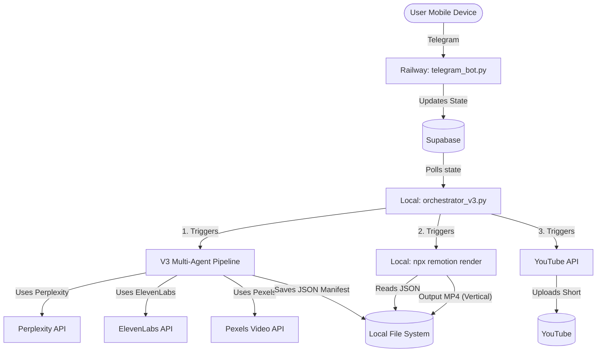

# Architecture (V3 Shorts Pipeline)

The V3 Pipeline is a fully decoupled, cloud-local hybrid system that leverages specialized AI agents to generate video content and a local React/Remotion renderer to produce the final MP4. 

**V3 Pivot:** The system is exclusively focused on **YouTube Shorts** (9:16 aspect ratio, 1080x1920 resolution, under 60 seconds) with rapid micro-beats and dynamic, word-level subtitles.

## High-Level Topology

## The Workflow

1. **Injection:** A video topic is passed to the V3 Orchestrator (via CLI `run_v3.py` or Supabase polling).
2. **Multi-Agent Generation (`run_v3.py`):**
   The pipeline consists of specialized agents using Pydantic strictly-typed schemas:
   - `BriefAgent`: Defines the `VideoBrief` (topic, target duration ~45s, promise).
   - `ThumbnailAgent`: Generates the DALL-E prompt (even though Shorts primarily use automatic thumbnails).
   - `ResearchAgent`: Queries Perplexity to generate a `VerifiedResearchPacket` (source-backed facts).
   - `StoryAgent`: Writes the `StoryBlueprint` using strict **micro-beats** (max 10-15 words per beat) for fast pacing.
   - `VisualDirectorAgent`: Assigns specific UI components (`CinematicMedia`, `EvidenceCard`) to each beat, outputting a `VisualBriefPlan`.
   - `AssetResolver`: Searches the Pexels API explicitly for `portrait` videos (1080x1920).
   - `AudioDirectorAgent`: Uses ElevenLabs to generate voiceover and extracts **word-level timestamps** for subtitles.
   
3. **Compilation (`compiler_v3.py`):**
   The `ManifestCompiler` converts all the plans into a deterministic `ProductionManifest` JSON file (1080x1920, 30fps) linking exact frames, Remotion components, and word timestamps.

4. **Local Rendering (`remotion/`):**
   Remotion parses the JSON. It maps visual shots into `<Sequence>` components and maps the `word_timestamps` array to a dynamic `<Subtitles />` component overlaid at the center of the vertical video. `npx remotion render` outputs the final MP4.

5. **Publishing:**
   The short is uploaded to YouTube natively as a Short.
