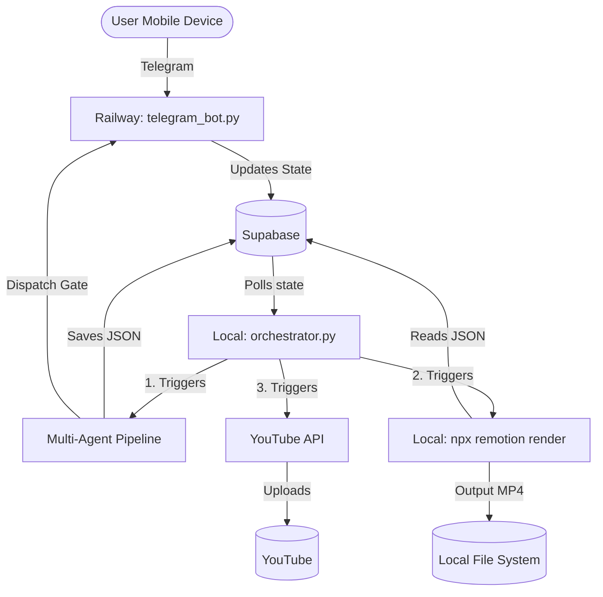

# Architecture (V2 Pipeline)

The V2 Pipeline is a fully decoupled, cloud-local hybrid system that leverages specialized AI agents to generate video content and a local React/Remotion renderer to produce the final MP4.

## High-Level Topology

## The Workflow

1. **Injection:** A video topic is injected into the `videos` table in Supabase with `status="approved"`. (This can be done via manual script or an automated niche discovery agent).
2. **Polling:** The local `orchestrator.py` continuously polls the `videos` table for `status="approved"`.
3. **Multi-Agent Generation (`run_v2.py`):**
   When an approved video is found, the orchestrator triggers the multi-agent pipeline.
   The pipeline consists of specialized agents that execute in sequence:
   - `Learning Engine`: Checks global feedback.
   - `Research Agent`: Gathers facts.
   - `Angle Selector`: Chooses the narrative approach.
   - `Marketing Strategist`: Defines the hook and SEO metadata.
   - `Thumbnail Creator`: Plans the visual thumbnail.
   - `Story Architect`: Outlines the beats.
   - `Script Writer`: Drafts the voiceover.
   - `Retention Critic & Rewriter`: Reviews and edits the script.
   - `Quality Evaluation & Gate`: Scores the content out of 10.
   - `Scene Director Pipeline`: Plans timings, shots, and compiles a `RendererManifest`.
   
   Every agent saves its output as a row in the `artifacts` table. If the script generation fails or crashes, it can resume from the last saved artifact.

4. **Human-in-the-Loop Gate (`publisher.py`):**
   Once the AI finishes generating the entire blueprint (`RendererManifest`), it halts. 
   It sends a Telegram message containing the target title and a generated thumbnail preview to the user.
   The database status is set to `scripting` (or a similar intermediate state).
   
5. **Approval:**
   The user clicks "Approve & Render" in Telegram. The Railway bot (`telegram_bot.py`) receives the webhook/poll, updates the video status in Supabase to `awaiting_publish_approval`, and sends an acknowledgment message.
   
6. **Local Rendering (`orchestrator.py` -> `render_v2.py`):**
   The local orchestrator, which is also polling for `awaiting_publish_approval`, picks up the video.
   It updates the status to `rendering` and executes `npx remotion render` in the `/remotion` folder. 
   Remotion downloads the assets and renders the video using the React composition logic.
   
7. **Publishing:**
   Once Remotion outputs the MP4 to the local filesystem, the orchestrator triggers the YouTube Uploader. The MP4 and the generated thumbnail are uploaded to YouTube, and the database status is marked as `published`.
