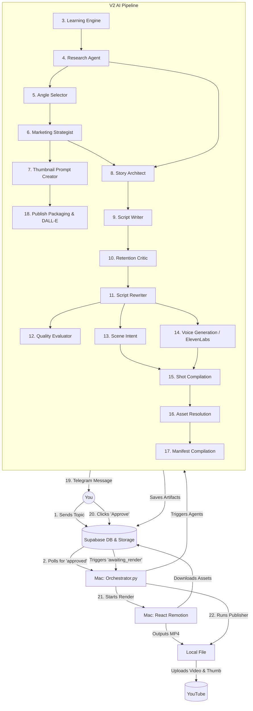

# YouTube Automation - Workflow Walkthrough (V2)

Αυτό το έγγραφο περιγράφει βήμα προς βήμα την πλήρη διαδρομή ζωής ενός βίντεο, από τη στιγμή που δίνεται το αρχικό θέμα (Topic) μέχρι να δημοσιευτεί στο YouTube. Κάθε βήμα εκτελείται από έναν εξειδικευμένο AI Agent ή Script.

---

## Φάση 1: Έναρξη & Έρευνα

### 1. Topic Injection (Telegram Bot)
* **Τι κάνει:** Ο χρήστης στέλνει ένα θέμα (π.χ. "Η ιστορία της Apple") μέσω του Telegram Bot. Το Bot καταχωρεί το θέμα στη βάση.
* **Input:** Το μήνυμα κειμένου του χρήστη.
* **Output:** Μία εγγραφή (row) στον πίνακα `videos` (Supabase) με `status = 'approved'`.

### 2. Orchestrator Polling
* **Τι κάνει:** Το τοπικό `orchestrator.py` (που τρέχει 24/7 στο Mac) ελέγχει συνεχώς τη βάση. Μόλις βρει βίντεο με `status='approved'`, ξεκινά το V2 Multi-Agent Pipeline.

### 3. Learning Engine
* **Τι κάνει:** Αναλύει τα analytics και τα σχόλια από προηγούμενα βίντεο για να βρει τι δουλεύει και τι όχι (π.χ. pacing, hook retention).
* **Input:** Δεδομένα από τον πίνακα `videos` και `youtube_analytics`.
* **Output:** `GlobalFeedback` (Κατευθυντήριες οδηγίες για τους επόμενους agents).

### 4. Research Agent
* **Τι κάνει:** Ερευνά το θέμα, συγκεντρώνοντας αληθινά facts, εντυπωσιακά στατιστικά και συγκεκριμένες λεπτομέρειες.
* **Input:** `Target Title` (Το θέμα).
* **Output:** `ResearchPacket` (Μια δομημένη λίστα από verified facts).

---

## Φάση 2: Στρατηγική & Μάρκετινγκ

### 5. Angle Selector
* **Τι κάνει:** Επιλέγει την καλύτερη σεναριακή "γωνία" (π.χ. Μυστήριο, Αντίφαση, Success Story) βασισμένος στα facts της έρευνας.
* **Input:** `ResearchPacket`.
* **Output:** `AngleStrategy` (Το συναίσθημα και η κεντρική οπτική γωνία).

### 6. Marketing Strategist
* **Τι κάνει:** Δημιουργεί ιδέες για τίτλους (Clickable Titles), σχεδιάζει το visual concept του Thumbnail, και επιλέγει το πιο δυνατό Hook Concept.
* **Input:** `AngleStrategy`, `GlobalFeedback`.
* **Output:** `MarketingStrategy`.

### 7. Thumbnail Prompt Creator
* **Τι κάνει:** Μεταφράζει το Thumbnail Concept του Marketing Strategist σε ένα εξαιρετικά αναλυτικό και κινηματογραφικό DALL-E/Midjourney prompt.
* **Input:** `MarketingStrategy`.
* **Output:** `ThumbnailPromptPlan`.

---

## Φάση 3: Σεναριογραφία & Ποιότητα

### 8. Story Architect
* **Τι κάνει:** Σχεδιάζει τον σκελετό της ιστορίας χωρίζοντάς την σε 5-6 ρυθμικά "beats" (Hook, Question, Escalation, Reveal κλπ.), επιβάλλοντας pattern interrupts.
* **Input:** `MarketingStrategy`, `ResearchPacket`.
* **Output:** `StoryBeatPlan`.

### 9. Script Writer
* **Τι κάνει:** Γράφει τα ακριβή λόγια (Narration) για το κάθε beat. **Αυστηρός κανόνας:** Το κείμενο δεν περιέχει καμία σκηνοθετική οδηγία, παρά μόνο τα λόγια που θα ακουστούν!
* **Input:** `StoryBeatPlan`, `ResearchPacket`, `MarketingStrategy`.
* **Output:** `StoryScript` (Το αρχικό προσχέδιο).

### 10. Retention Critic
* **Τι κάνει:** Παίζει τον ρόλο του "αυστηρού θεατή". Διαβάζει το σενάριο και εντοπίζει σημεία που είναι βαρετά, έχουν χαμηλή πυκνότητα πληροφορίας, ή δεν κρατούν την προσοχή (retention drops).
* **Input:** `StoryScript`.
* **Output:** `CriticReview` (Σκληρή κριτική).

### 11. Script Rewriter
* **Τι κάνει:** Διαβάζει την κριτική και **ξαναγράφει** τα προβληματικά σημεία του σεναρίου ώστε να γίνουν πιο γρήγορα και ελκυστικά, διατηρώντας το όριο λέξεων (150).
* **Input:** `StoryScript`, `CriticReview`.
* **Output:** `EditedStoryScript` (Το τελικό, βελτιωμένο σενάριο).

### 12. Quality Evaluation & Gate
* **Τι κάνει:** Βαθμολογεί το τελικό σενάριο με άριστα το 10. Αν ο βαθμός είναι κάτω από 7, μπλοκάρει (ή επαναλαμβάνει) τη διαδικασία.
* **Input:** `EditedStoryScript`.
* **Output:** `QualityScoreReport` & `QualityGateDecision`.

---

## Φάση 4: Παραγωγή (Media & Assets)

### 13. Scene Intent Generation
* **Τι κάνει:** Σκηνοθετεί την κάθε πρόταση του σεναρίου. Αποφασίζει τι ακριβώς συναίσθημα ή εικόνα πρέπει να βλέπει ο θεατής εκείνη τη στιγμή.
* **Input:** `EditedStoryScript`.
* **Output:** `SceneIntentPlan`.

### 14. Voice Generation (ElevenLabs)
* **Τι κάνει:** Στέλνει το τελικό κείμενο στο ElevenLabs API. Επιστρέφει το αρχείο φωνής (.mp3) και τους ακριβείς χρόνους (timestamps) για το πότε ακούγεται η κάθε λέξη!
* **Input:** `EditedStoryScript`.
* **Output:** `TimingMap` (Λέξεις, Χρόνοι) + (Αποθήκευση του MP3 στο Supabase Storage).

### 15. Shot Compilation
* **Τι κάνει:** Ενώνει τη σκηνοθεσία (Intents) με τους χρόνους (Timings) για να ορίσει πότε ακριβώς αλλάζει το κάθε πλάνο/σκηνή στην οθόνη.
* **Input:** `SceneIntentPlan`, `TimingMap`.
* **Output:** `ShotPlan`.

### 16. Asset Resolution
* **Τι κάνει:** Ψάχνει τοπικά ή στο internet για να βρει τις πραγματικές εικόνες/βίντεο (backgrounds) που ταιριάζουν στις οδηγίες του ShotPlan.
* **Input:** `ShotPlan`.
* **Output:** `AssetManifest` (Λίστα με image URLs).

### 17. Manifest Compilation
* **Τι κάνει:** Συγκεντρώνει όλα τα επιμέρους κομμάτια (Ήχος, Εικόνες, Χρόνοι, Λέξεις) και τα "δένει" σε ένα τεράστιο τελικό JSON (props.json) που μπορεί να διαβάσει το React Remotion.
* **Input:** `AssetManifest`, `TimingMap`, `EditedStoryScript`.
* **Output:** `RendererManifest`.

### 18. Publish Packaging & Thumbnail Generation
* **Τι κάνει:** Χρησιμοποιεί το DALL-E 3 (ή άλλη Image API) για να φτιάξει την τελική εικόνα του Thumbnail. Ετοιμάζει τον τίτλο, τα tags, και την περιγραφή του YouTube.
* **Input:** `MarketingStrategy`, `ThumbnailPromptPlan`.
* **Output:** `PublishPackage` + (Αποθήκευση του Image URL).

---

## Φάση 5: Έγκριση, Render & Δημοσίευση

### 19. Dispatch Human-in-the-Loop Review
* **Τι κάνει:** Το σύστημα σταματάει. Στέλνει μήνυμα στο Telegram του χρήστη με την έτοιμη εικόνα του Thumbnail, τον Τίτλο, και τα κουμπιά "Approve for Render" / "Reject".
* **Input:** `PublishPackage`.
* **Output:** Μήνυμα στο Telegram. (Το βίντεο πάει σε `scripting`/`review` state).

### 20. Local Remotion Rendering
* **Τι κάνει:** Μόλις ο χρήστης πατήσει "Approve", η βάση ενημερώνεται (awaiting_publish_approval). Το Orchestrator ξεκινάει το τοπικό React Remotion στο Mac.
* **Input:** `RendererManifest` (props.json).
* **Output:** Το έτοιμο, τελικό `video.mp4` αρχείο στον σκληρό δίσκο.

### 21. YouTube Upload
* **Τι κάνει:** Το script `publisher.py` ανεβάζει το τελικό mp4 βίντεο και το Thumbnail στο κανάλι του YouTube.
* **Input:** `video.mp4` & `PublishPackage`.
* **Output:** Το Live URL στο YouTube. Το βίντεο είναι πλέον Online!

---

## System Architecture Diagram (Mermaid)

