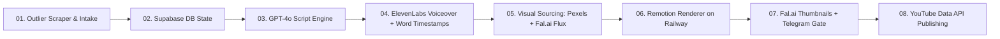

# Plan 00: Master Architecture Blueprint & Roadmap

## 1. Project Goal
Build an automated production engine to produce 8–10 minute documentary video essays (1,200–1,400 words across 35–45 scenes) in the style of MagnatesMedia and ColdFusion, with low production costs ($0.70–$1.60/video), high velocity (2–3 videos/week), and ~30 seconds human review.

---

## 2. End-to-End System Pipeline

---

## 3. Implementation Plan Index & Status

| Phase | Plan Document | Core Technology | Status | Live Resource / Workflow ID |
| :--- | :--- | :--- | :--- | :--- |
| **01** | [01_DATABASE_&_STATE_ENGINE.md](file:///Users/valsamis/Documents/Project%20-%20Youtube%20Automation/plans/01_DATABASE_&_STATE_ENGINE.md) | Supabase PostgreSQL + Storage | ✅ **Active** | `wrowkhhwlvmigvyescdv` (All tables & buckets live) |
| **02** | [02_TOPIC_INTAKE_&_OUTLIER_ENGINE.md](file:///Users/valsamis/Documents/Project%20-%20Youtube%20Automation/plans/02_TOPIC_INTAKE_&_OUTLIER_ENGINE.md) | yt-dlp + Telegram Polling Bot | ✅ **Active** | `fgoQbNLvlCJFsVyd` (24h Cron) + `telegram_bot.py` |
| **03** | [03_GPT4O_SCRIPT_GENERATION_ENGINE.md](file:///Users/valsamis/Documents/Project%20-%20Youtube%20Automation/plans/03_GPT4O_SCRIPT_GENERATION_ENGINE.md) | OpenAI GPT-4o (40-scene schema) | ✅ **Active** | `rGUAp4neG7fvcDP7` (5m Poller) + `script_generator.py` |
| **04** | [04_ELEVENLABS_AUDIO_&_TIMESTAMPS.md](file:///Users/valsamis/Documents/Project%20-%20Youtube%20Automation/plans/04_ELEVENLABS_AUDIO_&_TIMESTAMPS.md) | ElevenLabs Turbo v2.5 + Timestamps | ✅ **Active** | `abCwDKjKtDQIxaiu` + `audio_generator.py` |
| **05** | [05_HYBRID_ASSET_SOURCING_ENGINE.md](file:///Users/valsamis/Documents/Project%20-%20Youtube%20Automation/plans/05_HYBRID_ASSET_SOURCING_ENGINE.md) | Pexels HD Video + Fal.ai Flux | ✅ **Active** | `asset_resolver.py` (40/40 scenes matched) |
| **06** | [06_REMOTION_DOCKER_RENDERER.md](file:///Users/valsamis/Documents/Project%20-%20Youtube%20Automation/plans/06_REMOTION_DOCKER_RENDERER.md) | Remotion Headless Chromium (Docker on Railway) | ✅ **Active** | `https://renderer-service-production.up.railway.app` |
| **07** | [07_TELEGRAM_GATE_&_YOUTUBE_PUBLISHING.md](file:///Users/valsamis/Documents/Project%20-%20Youtube%20Automation/plans/07_TELEGRAM_GATE_&_YOUTUBE_PUBLISHING.md) | Fal.ai Flux + Telegram 1-Click Gate | ✅ **Active** | `publisher.py` (Review card with instant publish) |
| **08** | [08_N8N_ORCHESTRATION_PIPELINE.md](file:///Users/valsamis/Documents/Project%20-%20Youtube%20Automation/plans/08_N8N_ORCHESTRATION_PIPELINE.md) | n8n Master Pipeline | ✅ **Active** | `EoKCSSf4iXsG6szZ` (`YouTube Documentary Production Engine`) |

