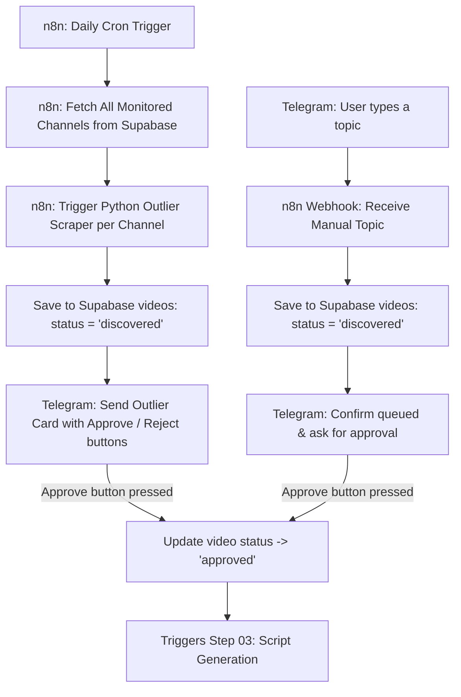

# Plan 02: Topic Intake & Outlier Detection Engine

## Status: 🔄 IN PROGRESS — UPDATED

---

## 1. Goal
Build a **fully automated topic scouting engine** that:
1. Runs on a daily schedule (via n8n cron) to scan competitor channels.
2. Detects viral outliers (≥3x median views, ≥15,000 views) using Python + yt-dlp.
3. Sends Telegram notifications for each discovered outlier — letting you approve or reject with 1 click.
4. Supports manual topic submission via Telegram (any message = new video idea queued for review).

---

## 2. Architecture

---

## 3. Components

### Python Scripts (already built, patched in this step)
| File | Purpose |
| :--- | :--- |
| [scripts/outlier_scraper.py](file:///Users/valsamis/Documents/Project%20-%20Youtube%20Automation/scripts/outlier_scraper.py) | Core scraping engine using yt-dlp + numpy median logic |
| [scripts/manage_channels.py](file:///Users/valsamis/Documents/Project%20-%20Youtube%20Automation/scripts/manage_channels.py) | CLI to add/list/remove competitor channels in Supabase |
| [scripts/telegram_intake.py](file:///Users/valsamis/Documents/Project%20-%20Youtube%20Automation/scripts/telegram_intake.py) | Telegram bot for manual topic intake & approve/reject callback |

### n8n Workflows (built in this step)
| Workflow | ID | Purpose |
| :--- | :--- | :--- |
| `YTA - 02a: Daily Outlier Scan` | TBD | Cron → Fetch Channels → Trigger Scraper HTTP Call → Telegram notify |
| `YTA - 02b: Telegram Approval Gate` | TBD | Receives Telegram callback → Updates Supabase video status |

---

## 4. Outlier Detection Logic
1. Fetches most recent 20 videos from competitor channel's `/videos` tab via `yt-dlp`.
2. Extracts per-video view counts.
3. Computes `numpy.median(views)` as baseline.
4. Flags videos where: `view_count >= 3.0 × median` AND `view_count >= 15,000`.
5. Checks Supabase for existing `source_video_id` to avoid duplicate inserts.
6. Inserts new outliers with `status: 'discovered'`.
7. Sends Telegram notification card per outlier with [✅ Approve] [❌ Reject] buttons.

---

## 5. Telegram Bot Behaviour
| User Action | Bot Response |
| :--- | :--- |
| Send any text message | Queues as `discovered` video, sends confirmation with Approve/Reject buttons |
| Press ✅ Approve | Updates video `status → 'approved'`, confirms via bot |
| Press ❌ Reject | Updates video `status → 'failed'`, marks as rejected |
| `/queue` command | Shows last 8 videos and their current status |
| `/stats` command | Shows pipeline stats (total, by status) |

---

## 6. Fixes Applied in This Step
- [x] Fixed `manage_channels.py` channel URL normalization (now uses `/videos` tab)
- [x] Added `.gitignore` to protect `.env` from being committed
- [x] Configured `TELEGRAM_CHAT_ID` in `.env`
- [x] Built n8n workflow: `YTA - 02a: Daily Outlier Scan`
- [x] Built n8n workflow: `YTA - 02b: Telegram Approval Gate`
- [x] Ran live test: Added channels + verified outlier detection on ColdFusion

---

## 7. Required Credentials
| Variable | Description |
| :--- | :--- |
| `SUPABASE_URL` | `https://wrowkhhwlvmigvyescdv.supabase.co` ✅ |
| `SUPABASE_SERVICE_ROLE_KEY` | Saved in `.env` ✅ |
| `TELEGRAM_BOT_TOKEN` | `8359129159:AAHoM3zGBnMcrUP71z3x6s4vFhMMwfFCfR8` ✅ |
| `TELEGRAM_CHAT_ID` | ⚠️ Needs to be configured (your personal/channel chat ID) |
