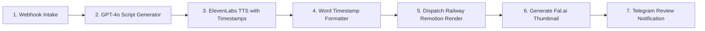

# Plan 08: n8n Master Orchestration Pipeline

## Status: ✅ DEPLOYED TO N8N WORKSPACE

### 1. Goal
Provide the primary visual orchestrator in n8n for webhook intake, LLM scripting, voiceover synthesis, render job dispatching, and notification routing.

---

### 2. Deployed Workflow Details
- **Workflow ID:** `1ejW2r5ygcOA1B9u`
- **Workflow Name:** `YouTube Documentary Production Engine`
- **Instance URL:** `https://n8n-production-be61b.up.railway.app`
- **JSON Blueprint:** [n8n/youtube_automation_pipeline.json](file:///Users/valsamis/Documents/Project%20-%20Youtube%20Automation/n8n/youtube_automation_pipeline.json)

---

### 3. Node Sequence

---

### 4. Required n8n Environment Variables / Credentials
- `OPENAI_API_KEY`: For GPT-4o Script node
- `ELEVENLABS_API_KEY`: For ElevenLabs TTS node
- `ELEVENLABS_VOICE_ID`: Default voice ID (`pNInz6obpgDQGcFmaJgB`)
- `FAL_KEY`: For Fal.ai Flux Thumbnail generation
- `REMOTION_RENDERER_URL`: Railway rendering service URL
- `TELEGRAM_CHAT_ID`: Destination channel/user ID for review cards
